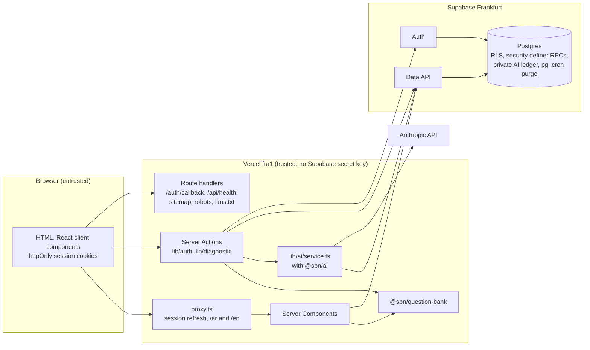
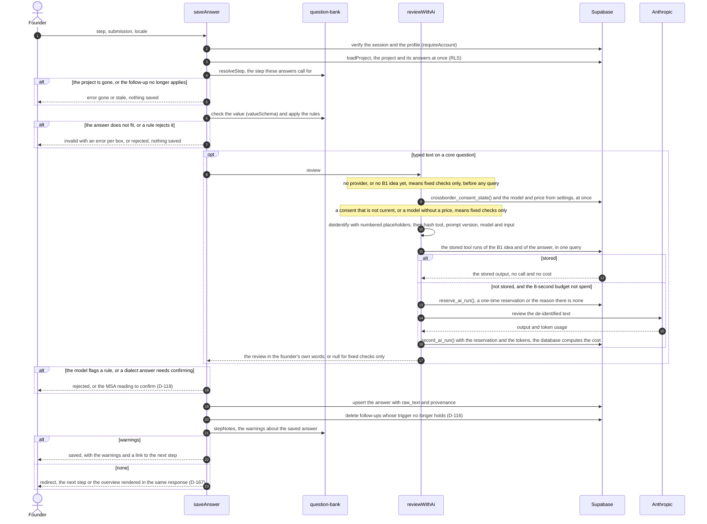

# Architecture

How Startup Brand Name is built, in the order of [arc42](https://arc42.org) but kept short. The
rules behind it are in [CLAUDE.md](../CLAUDE.md) and the decisions in [DECISIONS.md](DECISIONS.md);
this page links them together. It describes `main` after M3c and the audit fixes (D-126 to D-171),
as of 2026-10-05.

## 1. Goals and constraints

- A founder answers a structured diagnostic; deterministic code computes every number (rule 1);
  the model only reviews wording and, later, explains results.
- Arabic first (RTL) and English (LTR), one layout for both (D-067, D-056).
- Data stays in Frankfurt: Supabase `eu-central-1` and Vercel functions pinned to `fra1`
  (CLAUDE.md §3, D-019). Anything outside the EU is a named processor (D-082).
- No Supabase secret key in the app (D-077); its only server secret is `ANTHROPIC_API_KEY`. Row
  level security on every table (rule 6).
- Nothing waits without a deadline: every Supabase request, the proxy's session refresh and the AI
  review of a save have one (D-150, D-168).

## 2. Context

## 3. Containers and trust boundaries

| Boundary                   | What crosses                                     | What protects it                                                                                                                                                                                                                                                                                                                                                                                                                                                                                        |
| -------------------------- | ------------------------------------------------ | ------------------------------------------------------------------------------------------------------------------------------------------------------------------------------------------------------------------------------------------------------------------------------------------------------------------------------------------------------------------------------------------------------------------------------------------------------------------------------------------------------- |
| Browser → Vercel           | Page requests, Server Action calls, the callback | Every action and route parses its input with zod (rule 7). Sessions live in httpOnly cookies set by the server (D-077). The proxy refreshes an expiring session before routing, within 4 seconds; past that a page renders signed out and a Server Action keeps its cookies and checks the session itself (D-168). Security headers on every response (D-130); a Content-Security-Policy is still open ([M9 checklist](security/m9-checklist.md)).                                                      |
| Browser → Supabase, Google | Top-level redirects during Google sign-in only   | PKCE; the callback accepts only local `next` paths (`lib/auth/next-path.ts`). Otherwise the browser never calls Supabase (D-077).                                                                                                                                                                                                                                                                                                                                                                       |
| Vercel → Supabase          | Queries and RPC calls as the signed-in user      | Publishable key plus the user's session, so RLS applies to every query. Writes that need more than a policy go through `security definer` functions that act on `auth.uid()` only (D-085). Each request has a deadline: 8 seconds from pages, actions and route handlers, 3 seconds from the proxy (`lib/supabase/timed-fetch.ts`, D-168). The app holds no Supabase secret key.                                                                                                                        |
| Vercel → Anthropic         | De-identified answer text                        | Only with a current cross-border consent (`crossborder_consent_state()` is `current`, D-147), after `reserve_ai_run()` returns a reservation (D-146), with the text passed through `deidentify()` (rule 5, D-148), within the save's 8-second budget (D-150). The cost is computed and recorded by `record_ai_run()` in the database, never by the caller. The key is a server-only Sensitive variable, and the client bundle scan fails the build if it leaks; only `packages/ai` may declare the SDK. |
| Supabase → Resend, Google  | Code emails, OAuth                               | Configured in the dashboards ([auth-setup.md](runbooks/auth-setup.md)); the app holds none of these credentials.                                                                                                                                                                                                                                                                                                                                                                                        |
| GitHub Actions → Supabase  | Migrations                                       | Environment-scoped secrets; production runs only from `main` after the owner's approval ([operations.md](runbooks/operations.md)).                                                                                                                                                                                                                                                                                                                                                                      |

## 4. Runtime view: saving an answer

`saveAnswer` in `apps/web/src/lib/diagnostic/actions.ts`, with `reviewWithAi` in
`apps/web/src/lib/ai/service.ts`. Before it runs, the editor turns what was typed into a value in
the browser with the question bank (`fromDraft` in `apps/web/src/lib/diagnostic/draft.ts`): numbers
are read by `readNumber`, which never guesses, and a number that reads two ways ("1.500") is asked
about with both readings (D-156).

- **The idea first.** Before any other question is reviewed, the B1 idea statement must pass the
  same review as a coherent idea (D-072). Its answer is checked in memory before any query, and its
  review is normally reused from `tool_runs`.
- **Reservations and the ledger (D-146).** `reserve_ai_run()` counts the call against the user's
  day (`usage_counters`), refuses with `user_limit`, `global_cap` or `disabled`, and otherwise
  returns a reservation that holds the most its call can cost in `private.ai_spend_daily`.
  `record_ai_run()` takes an unused reservation of the same user from the last 5 minutes, computes
  the cost from `ai.prices`, clamps the tokens, writes the `tool_runs` row and swaps the hold for
  the real cost. A call that was cut off, or whose record failed, keeps counting at its hold. The
  ledger has no user or project key, so no deletion lowers the spend the global cap reads.
- **Time budget (D-150, D-151).** One `AbortSignal.timeout(8000)` (`AI_BUDGET_MS`) covers every AI
  step of a save; each SDK request has its own 8-second timeout and at most one retry; no
  reservation is made once the budget is spent. A call that throws or times out is not tried again
  for the same project and input for 10 minutes on that server instance, and an unusable stored
  output stays the result for its input. The step page allows 30 seconds (`maxDuration`).
- **Placeholders (D-148, D-149).** `deidentify()` replaces the account's email and sign-in names,
  other email addresses, phone numbers, contact links, IBANs and ID numbers with numbered
  placeholders (`[phone1]`) and keeps what each stands for. `restoreReview()` puts the founder's
  words back with `reidentify()`; a rewrite that lost, changed or invented a placeholder is not
  used, and the answer is saved as typed. `tool_runs` keeps the de-identified output, with the MSA
  wording only when the answer was really rewritten.
- **The confirmed MSA text** comes from the stored review, never from the browser. A reading that
  does not fit the question is not used either: the confirmed answer is saved as typed (D-129).
- **Logs (D-152).** Every case that ends in the fixed checks is logged as `ai.skipped` with its
  reason, every database or model error as `ai.error` with its stage. The founder is never blocked
  and is not told why.
- **Previous schema (D-155).** On a database without `crossborder_consent_state()` the review stays
  off and logs `ai.skipped` with reason `previous_schema` (see
  [operations.md](runbooks/operations.md#ai-after-the-audit-fixes)).

The step page uses the same question-bank functions as `saveAnswer` (D-160): `resolveStep` (an
inactive follow-up redirects to its question), `sequenceModeFor` and `positionInMode` for the order
and the "Question 7 of 20" title (D-161), and `stepNotes` for the warnings it shows on every visit.
Both read the project through `loadProject`, wrapped in React's `cache` so a page and its metadata
share one load (D-167).

## 5. Packages

| Package                                         | Holds                                                                                                                                                                                                                                                                                                                                                                            | Rules                                                                                                                                                                                                      | Enforced by                                                                                     |
| ----------------------------------------------- | -------------------------------------------------------------------------------------------------------------------------------------------------------------------------------------------------------------------------------------------------------------------------------------------------------------------------------------------------------------------------------- | ---------------------------------------------------------------------------------------------------------------------------------------------------------------------------------------------------------- | ----------------------------------------------------------------------------------------------- |
| `packages/engine` (`@sbn/engine`)               | Calculations T5, T7 to T10 and tax (M4); `ENGINE_VERSION`, stored on every tool run                                                                                                                                                                                                                                                                                              | Pure and deterministic: no I/O, framework or network imports; no `Math.random`, `Date.now` or `new Date()`; the reference date is an input.                                                                | ESLint (`eslint.config.mjs`), 95% line coverage                                                 |
| `packages/question-bank` (`@sbn/question-bank`) | The 64 questions and follow-ups in both languages, answer shapes (`valueSchema`, `numberLimits`, `maxItemsFor`), rules R1–R8 (`reviewAnswer`, `ruleFinding`), completeness, validation tasks, the steps (`resolveStep`, `findFollowUp`, `sequenceModeFor`, `positionInMode`, `stepNotes`), and reading typed numbers and currencies (`readNumber`, `numberText`, `readCurrency`) | Pure: no I/O, no clock, no AI. It decides what an answer means and what a step is, for the page, the editor and the action alike (D-160, D-163); the app stores the answer.                                | Review and tests (95% line coverage); the stored-answer contract (`contract.test.ts`, D-165)    |
| `packages/ai` (`@sbn/ai`)                       | Anthropic client (8-second requests, one retry), review prompt (`REVIEW_PROMPT_VERSION`), `deidentify` and `reidentify`, `restoreReview`, price schema, input hash, the `fake` client                                                                                                                                                                                            | Server only. No database access: the app passes the model in, and the database computes the cost. Prompts take only the `Deidentified` type; only this package declares the SDK. Tests never call the API. | 95% line coverage; `boundary.test.ts`; client bundle scan                                       |
| `packages/report` (`@sbn/report`)               | Report assembly and PDF (M5)                                                                                                                                                                                                                                                                                                                                                     | Empty until M5.                                                                                                                                                                                            |                                                                                                 |
| `packages/payments` (`@sbn/payments`)           | `PaymentProvider`, PayPal, card stub (M7)                                                                                                                                                                                                                                                                                                                                        | Empty until M7. Never stores card data.                                                                                                                                                                    |                                                                                                 |
| `apps/web` (`@sbn/web`)                         | Routes, UI, Server Actions, Supabase clients, env schemas, SEO, logging                                                                                                                                                                                                                                                                                                          | All I/O lives here. Server-only modules import `server-only`. Components use tokens and logical properties only (D-056). Logs go through `lib/log.ts` only (D-126).                                        | ESLint (Next.js, jsx-a11y strict, `no-console`), `check-logical-css.mjs`, coverage gate (D-164) |

Dependencies point one way: `apps/web` uses the packages; `@sbn/ai` and `@sbn/question-bank`
depend only on zod (and the Anthropic SDK), never on each other or on the app.

## 6. Cross-cutting concepts

- **One source of truth (rule 3).** Completeness and validation tasks are computed from the
  answers, never stored (D-113); follow-ups are deleted when their trigger goes, and loading ignores
  one whose trigger no longer holds (D-116, D-129). What a step is and which warnings it shows come
  from the question bank only (D-160).
- **Provenance (rule 2).** Every answer row carries `source`, `confidence` and `validated`
  (D-104, D-114); the typed text stays in `raw_text` (D-119).
- **Stored answers (D-165).** `contract.test.ts` pins every question's field kind and stored shape;
  a change to it needs a migration of `answers.normalized_value` or a read-time mapping.
- **Reuse and cost (rules 4 and 10).** Model runs are keyed by `input_hash` and reused per project;
  model, prices and limits live in `settings` (D-120, D-122). The app reads the model and its price
  at most once a minute per server instance (`SETTINGS_TTL_MS`, D-167); the database computes each
  run's cost and keeps the daily spend in `private.ai_spend_daily` (D-146).
- **Consent (D-147).** A cross-border consent counts only for a text version listed in the settings
  key `consent.crossborder.accepted_versions`. `crossborder_consent_state()` answers `current`,
  `outdated` or `none`; only `current` lets the review run. The account page shows the text and
  the state and offers "Renew my consent"; a typed-answer step links to it while the consent is
  outdated. A new wording needs a
  new `CROSSBORDER_VERSION` (`apps/web/src/config/legal.ts`, pinned by `legal.test.ts`) and a
  migration that lists it.
- **Deadlines (D-150, D-168).** Supabase requests: 8 seconds from pages, actions and route
  handlers, 3 seconds from the proxy; the proxy's whole session refresh: 4 seconds
  (`REFRESH_DEADLINE_MS`); the AI review of one save: 8 seconds; the step page: 30 seconds.
- **Failures a person can meet (D-127, D-128, D-129).** A Server Action returns a typed result for
  each of them and logs it; it throws only for input no page sends. Forms call actions through
  `callAction` and `useActionState`. Error pages show the digest as a reference number.
- **Configuration.** Environment variables are parsed by zod in `apps/web/src/env/` (D-009);
  runtime values that change without a release live in `settings`.
- **Languages.** next-intl with `/ar` and `/en` prefixes (D-070, D-075); Arabic messages are the
  reference catalogue. The root provider sends the browser only the namespaces every page needs
  (`ROOT_NAMESPACES` in `apps/web/src/i18n/client-messages.ts`); a route adds the ones its client
  components read with `ClientMessages`, checked by `client-messages.test.ts` (D-169).
- **Performance budgets (D-171).** JavaScript per route (`scripts/check-bundle-budget.mjs`, in the
  `checks` job), and script bytes, font bytes and layout shift per public page
  (`apps/web/scripts/lighthouse.mjs`); [operations.md](runbooks/operations.md#budgets) says how to
  change one.
- **Deletion.** Every user table in `public`, and `private.ai_reservations`, cascades from
  `auth.users`, so `delete_my_account()` and the 24-hour purge of incomplete accounts (D-079) empty
  them all (`erasure_guard.test.sql`, D-144). `private.ai_spend_daily` holds no user or project key
  and stays. Supabase's auth audit log does not cascade: its entries outlive the account
  ([OPEN-QUESTIONS #87](OPEN-QUESTIONS.md)).
- **Observability.** Server logs are JSON lines from `apps/web/src/lib/log.ts`, with allowlisted
  fields only and never answer text or an email (D-126): among them `ai.skipped`, `ai.error`
  (D-152) and `proxy.refresh_timeout` (D-168). `GET /api/health` reports the region, whether AI is
  on, and Supabase reachability. See the M9 checklist for what is missing.

## 7. Deployment

|            | App                                                      | Database                                                                       | Migrations                                                 |
| ---------- | -------------------------------------------------------- | ------------------------------------------------------------------------------ | ---------------------------------------------------------- |
| Local      | `pnpm dev` (port 3000); tests start `next start` on 3100 | Supabase CLI in Docker: API 54321, database 54322, Studio 54323, Mailpit 54324 | `pnpm db:reset`                                            |
| Preview    | Vercel Preview, functions in `fra1`                      | `startupbrandname-staging`                                                     | `DB deploy`, automatically when `main` changes a migration |
| Production | Vercel Production, `startupbrandname.com`, `fra1`        | `startupbrandname-prod`                                                        | `DB deploy` from `main`, after the owner's approval        |

Release order, rollback and kill switches: [runbooks/operations.md](runbooks/operations.md).

## 8. Where to change what

| To change                             | Edit                                                                                                      | Also                                                                                                                                                            |
| ------------------------------------- | --------------------------------------------------------------------------------------------------------- | --------------------------------------------------------------------------------------------------------------------------------------------------------------- |
| Interface text                        | `apps/web/messages/ar.json` and `en.json`                                                                 | Same keys and placeholders (`messages.test.ts`); a namespace a client component reads must reach it (`client-messages.test.ts`)                                 |
| Public page text                      | `apps/web/src/content/*.ts` (D-095)                                                                       | Share images if a title changes (D-096)                                                                                                                         |
| The list of public pages              | `apps/web/src/config/public-pages.ts`                                                                     | Sitemap, llms.txt, accessibility, snapshots and Lighthouse follow it                                                                                            |
| Plans, prices, entitlements           | `apps/web/src/config/plans.ts` (pinned to CLAUDE.md §3 by `plans.test.ts`)                                | The matching `settings` row by migration                                                                                                                        |
| A question, option, follow-up or rule | `packages/question-bank/src/questions/`, `follow-ups.ts`, `review.ts`, `options.ts`                       | CONTRIBUTING checklist: stored answers must still parse (`contract.test.ts`, D-165)                                                                             |
| Reading typed numbers                 | `packages/question-bank/src/numbers.ts` (`readNumber`, `numberText`)                                      | D-156; the scale words are open (#88)                                                                                                                           |
| Completeness weights and gates        | `packages/question-bank/src/completeness.ts`                                                              | D-102, D-105, D-110                                                                                                                                             |
| Diagnostic order and URLs             | `packages/question-bank/src/sequence.ts`, `apps/web/src/lib/diagnostic/steps.ts`                          | D-117, D-160                                                                                                                                                    |
| The review prompt                     | `packages/ai/src/review-text.ts`                                                                          | Bump `REVIEW_PROMPT_VERSION` so old reviews are not reused                                                                                                      |
| De-identification                     | `packages/ai/src/deidentify.ts`                                                                           | Its tests, including the negative tests on amounts; rule 5, D-148                                                                                               |
| Model, prices, AI limits              | A migration that updates `settings`                                                                       | [operations.md](runbooks/operations.md)                                                                                                                         |
| The AI time budget                    | `AI_BUDGET_MS` in `apps/web/src/lib/ai/service.ts`, `REQUEST_TIMEOUT_MS` in `packages/ai/src/client.ts`   | Stay within the step page's `maxDuration` with the Supabase deadlines (D-150, D-168)                                                                            |
| Supabase deadlines                    | `apps/web/src/lib/supabase/timed-fetch.ts`, `REFRESH_DEADLINE_MS` in `apps/web/src/lib/supabase/proxy.ts` | D-168                                                                                                                                                           |
| Performance budgets                   | `scripts/check-bundle-budget.mjs`, `apps/web/scripts/lighthouse.mjs`                                      | A decision with the reason ([operations.md](runbooks/operations.md#budgets))                                                                                    |
| An environment variable               | `apps/web/src/env/server.ts` or `client.ts`                                                               | CONTRIBUTING checklist                                                                                                                                          |
| Log events and fields                 | `apps/web/src/lib/log.ts`                                                                                 | Only short tokens in allowlisted fields (`log.test.ts`, D-126)                                                                                                  |
| Tables, policies, database functions  | A new file in `supabase/migrations`                                                                       | pgTAP in `supabase/tests`, `pnpm db:types`                                                                                                                      |
| Design tokens                         | `apps/web/src/styles/tokens.css`                                                                          | `contrast.test.ts`, snapshots                                                                                                                                   |
| UI components                         | `apps/web/src/components/ui/`                                                                             | `/ar/design`, snapshots                                                                                                                                         |
| Countries and markets                 | `apps/web/src/lib/countries.ts`, `apps/web/src/lib/markets.ts`                                            | D-080, D-081, D-088                                                                                                                                             |
| Legal text versions                   | `apps/web/src/config/legal.ts`                                                                            | Bump the version whenever the wording changes; a new `CROSSBORDER_VERSION` also needs a migration listing it in `consent.crossborder.accepted_versions` (D-147) |
| Privacy and terms drafts              | `apps/web/src/app/[locale]/(site)/privacy/content.tsx`, `terms/content.tsx`                               | `TERMS_VERSION`, `PRIVACY_UPDATED`; [processing register](privacy/processing-register.md)                                                                       |
| Language routing                      | `apps/web/src/i18n/`, `apps/web/src/proxy.ts`                                                             | D-070, D-075                                                                                                                                                    |
| Search indexing, structured data      | `apps/web/src/seo/`                                                                                       | D-054, D-101                                                                                                                                                    |
| The sign-in email                     | `supabase/templates/code.html`                                                                            | Paste into both hosted projects ([auth-setup.md](runbooks/auth-setup.md))                                                                                       |
| Engine formulas (M4)                  | `packages/engine/src/`                                                                                    | Bump `ENGINE_VERSION` whenever an output can change                                                                                                             |
| CI                                    | `.github/workflows/`                                                                                      | [TESTING.md](TESTING.md)                                                                                                                                        |
