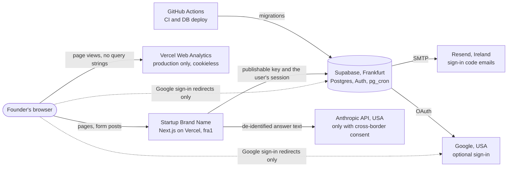
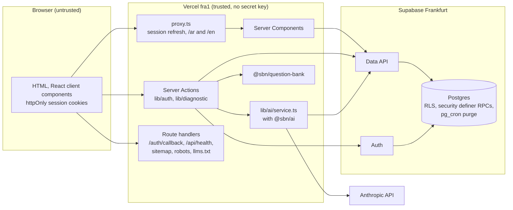
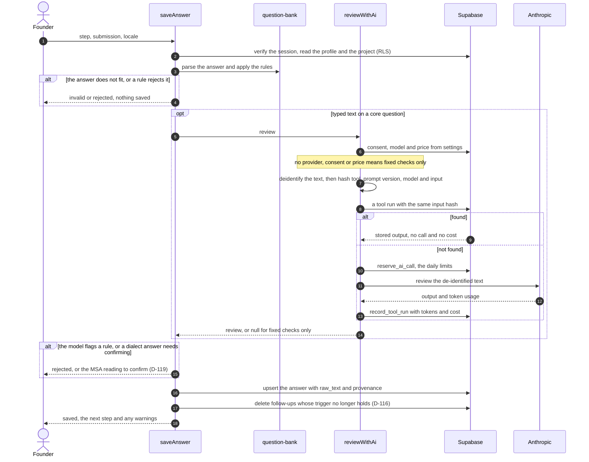

# Architecture

How Startup Brand Name is built, in the order of [arc42](https://arc42.org) but kept short. The
rules behind it are in [CLAUDE.md](../CLAUDE.md) and the decisions in [DECISIONS.md](DECISIONS.md);
this page links them together. It describes `main` as of M3c.

## 1. Goals and constraints

- A founder answers a structured diagnostic; deterministic code computes every number (rule 1);
  the model only reviews wording and, later, explains results.
- Arabic first (RTL) and English (LTR), one layout for both (D-067, D-056).
- Data stays in Frankfurt: Supabase `eu-central-1` and Vercel functions pinned to `fra1`
  (CLAUDE.md §3, D-019). Anything outside the EU is a named processor (D-082).
- No secret key in the app (D-077). Row level security on every table (rule 6).

## 2. Context

## 3. Containers and trust boundaries

| Boundary                   | What crosses                                     | What protects it                                                                                                                                                                                                                                                    |
| -------------------------- | ------------------------------------------------ | ------------------------------------------------------------------------------------------------------------------------------------------------------------------------------------------------------------------------------------------------------------------- |
| Browser → Vercel           | Page requests, Server Action calls, the callback | Every action and route parses its input with zod (rule 7). Sessions live in httpOnly cookies set by the server (D-077). The proxy refreshes an expiring session before routing. A Content-Security-Policy is still open ([M9 checklist](security/m9-checklist.md)). |
| Browser → Supabase, Google | Top-level redirects during Google sign-in only   | PKCE; the callback accepts only local `next` paths (`lib/auth/next-path.ts`). Otherwise the browser never calls Supabase (D-077).                                                                                                                                   |
| Vercel → Supabase          | Queries and RPC calls as the signed-in user      | Publishable key plus the user's session, so RLS applies to every query. Writes that need more than a policy go through `security definer` functions that act on `auth.uid()` only (D-085). The app holds no secret key.                                             |
| Vercel → Anthropic         | De-identified answer text                        | Only with cross-border consent (D-103), after `reserve_ai_call()` (D-120), text passed through `deidentify()` (rule 5, D-107). The key is a server-only Sensitive variable, and the client bundle scan fails the build if it leaks.                                 |
| Supabase → Resend, Google  | Code emails, OAuth                               | Configured in the dashboards ([auth-setup.md](runbooks/auth-setup.md)); the app holds none of these credentials.                                                                                                                                                    |
| GitHub Actions → Supabase  | Migrations                                       | Environment-scoped secrets; production runs only from `main` after the owner's approval ([operations.md](runbooks/operations.md)).                                                                                                                                  |

## 4. Runtime view: saving an answer

`saveAnswer` in `apps/web/src/lib/diagnostic/actions.ts`, with `reviewWithAi` in
`apps/web/src/lib/ai/service.ts`.

- Before any other question is reviewed, the B1 idea statement must pass the same review as a
  coherent idea (D-072); that review is normally reused from `tool_runs`.
- A failed or unusable call still counts against the user's day and is recorded when it returned
  usage (D-124). Any failure falls back to the fixed checks; the founder is never blocked.
- The confirmed MSA text comes from the stored review, never from the browser.

## 5. Packages

| Package                                         | Holds                                                                                                                                 | Rules                                                                                                                                       | Enforced by                                                |
| ----------------------------------------------- | ------------------------------------------------------------------------------------------------------------------------------------- | ------------------------------------------------------------------------------------------------------------------------------------------- | ---------------------------------------------------------- |
| `packages/engine` (`@sbn/engine`)               | Calculations T5, T7 to T10 and tax (M4); `ENGINE_VERSION`, stored on every tool run                                                   | Pure and deterministic: no I/O, framework or network imports; no `Math.random`, `Date.now` or `new Date()`; the reference date is an input. | ESLint (`eslint.config.mjs`), 95% line coverage            |
| `packages/question-bank` (`@sbn/question-bank`) | The 64 questions and follow-ups in both languages, answer shapes (zod), rules R1–R8, completeness, validation tasks, currency reading | Pure: no I/O, no clock, no AI. It decides what an answer means; the app stores it.                                                          | Review and tests (95% line coverage); not lint-enforced    |
| `packages/ai` (`@sbn/ai`)                       | Anthropic client, review prompt, `deidentify`, cost, input hash, the `fake` client                                                    | Server only. No database access: the app passes the model and price in and records the run. Tests never call the API.                       | 95% line coverage; client bundle scan                      |
| `packages/report` (`@sbn/report`)               | Report assembly and PDF (M5)                                                                                                          | Empty until M5.                                                                                                                             |                                                            |
| `packages/payments` (`@sbn/payments`)           | `PaymentProvider`, PayPal, card stub (M7)                                                                                             | Empty until M7. Never stores card data.                                                                                                     |                                                            |
| `apps/web` (`@sbn/web`)                         | Routes, UI, Server Actions, Supabase clients, env schemas, SEO                                                                        | All I/O lives here. Server-only modules import `server-only`. Components use tokens and logical properties only (D-056).                    | ESLint (Next.js, jsx-a11y strict), `check-logical-css.mjs` |

Dependencies point one way: `apps/web` uses the packages; `@sbn/ai` and `@sbn/question-bank`
depend only on zod (and the Anthropic SDK), never on each other or on the app.

## 6. Cross-cutting concepts

- **One source of truth (rule 3).** Completeness and validation tasks are computed from the
  answers, never stored (D-113); follow-ups are deleted when their trigger goes (D-116).
- **Provenance (rule 2).** Every answer row carries `source`, `confidence` and `validated`
  (D-104, D-114); the typed text stays in `raw_text` (D-119).
- **Reuse and cost (rules 4 and 10).** Model runs are keyed by `input_hash` and reused per project;
  model, prices and limits live in `settings` (D-120, D-122, D-124).
- **Configuration.** Environment variables are parsed by zod in `apps/web/src/env/` (D-009);
  runtime values that change without a release live in `settings`.
- **Languages.** next-intl with `/ar` and `/en` prefixes (D-070, D-075); Arabic messages are the
  reference catalogue.
- **Deletion.** Every user table in `public` cascades from `auth.users`, so `delete_my_account()`
  and the 24-hour purge of incomplete accounts (D-079) empty them all. Supabase's auth audit log
  does not cascade: its entries outlive the account until PRIV-15 is decided
  ([M9 checklist](security/m9-checklist.md)).
- **Observability.** `GET /api/health` reports region and Supabase reachability; errors are
  logged by name and code only, never with answer text. See the M9 checklist for what is missing.

## 7. Deployment

|            | App                                                      | Database                                                                       | Migrations                                                 |
| ---------- | -------------------------------------------------------- | ------------------------------------------------------------------------------ | ---------------------------------------------------------- |
| Local      | `pnpm dev` (port 3000); tests start `next start` on 3100 | Supabase CLI in Docker: API 54321, database 54322, Studio 54323, Mailpit 54324 | `pnpm db:reset`                                            |
| Preview    | Vercel Preview, functions in `fra1`                      | `startupbrandname-staging`                                                     | `DB deploy`, automatically when `main` changes a migration |
| Production | Vercel Production, `startupbrandname.com`, `fra1`        | `startupbrandname-prod`                                                        | `DB deploy` from `main`, after the owner's approval        |

Release order, rollback and kill switches: [runbooks/operations.md](runbooks/operations.md).

## 8. Where to change what

| To change                             | Edit                                                                                | Also                                                                      |
| ------------------------------------- | ----------------------------------------------------------------------------------- | ------------------------------------------------------------------------- |
| Interface text                        | `apps/web/messages/ar.json` and `en.json`                                           | Same keys and placeholders (`messages.test.ts`)                           |
| Public page text                      | `apps/web/src/content/*.ts` (D-095)                                                 | Share images if a title changes (D-096)                                   |
| The list of public pages              | `apps/web/src/config/public-pages.ts`                                               | Sitemap, llms.txt, accessibility, snapshots and Lighthouse follow it      |
| Plans, prices, entitlements           | `apps/web/src/config/plans.ts` (pinned to CLAUDE.md §3 by `plans.test.ts`)          | The matching `settings` row by migration                                  |
| A question, option, follow-up or rule | `packages/question-bank/src/questions/`, `follow-ups.ts`, `review.ts`, `options.ts` | CONTRIBUTING checklist: stored answers must still parse                   |
| Completeness weights and gates        | `packages/question-bank/src/completeness.ts`                                        | D-102, D-105, D-110                                                       |
| Diagnostic order and URLs             | `packages/question-bank/src/sequence.ts`, `apps/web/src/lib/diagnostic/steps.ts`    | D-117                                                                     |
| The review prompt                     | `packages/ai/src/review-text.ts`                                                    | Bump `REVIEW_PROMPT_VERSION` so old reviews are not reused                |
| De-identification                     | `packages/ai/src/deidentify.ts`                                                     | Its tests; rule 5                                                         |
| Model, prices, AI limits              | A migration that updates `settings`                                                 | [operations.md](runbooks/operations.md)                                   |
| An environment variable               | `apps/web/src/env/server.ts` or `client.ts`                                         | CONTRIBUTING checklist                                                    |
| Tables, policies, database functions  | A new file in `supabase/migrations`                                                 | pgTAP in `supabase/tests`, `pnpm db:types`                                |
| Design tokens                         | `apps/web/src/styles/tokens.css`                                                    | `contrast.test.ts`, snapshots                                             |
| UI components                         | `apps/web/src/components/ui/`                                                       | `/ar/design`, snapshots                                                   |
| Countries and markets                 | `apps/web/src/lib/countries.ts`, `apps/web/src/lib/markets.ts`                      | D-080, D-081, D-088                                                       |
| Legal text versions                   | `apps/web/src/config/legal.ts`                                                      | Bump the version whenever the wording changes                             |
| Privacy and terms drafts              | `apps/web/src/app/[locale]/(site)/privacy/content.tsx`, `terms/content.tsx`         | [processing register](privacy/processing-register.md)                     |
| Language routing                      | `apps/web/src/i18n/`, `apps/web/src/proxy.ts`                                       | D-070, D-075                                                              |
| Search indexing, structured data      | `apps/web/src/seo/`                                                                 | D-054, D-101                                                              |
| The sign-in email                     | `supabase/templates/code.html`                                                      | Paste into both hosted projects ([auth-setup.md](runbooks/auth-setup.md)) |
| Engine formulas (M4)                  | `packages/engine/src/`                                                              | Bump `ENGINE_VERSION` whenever an output can change                       |
| CI                                    | `.github/workflows/`                                                                | [TESTING.md](TESTING.md)                                                  |
